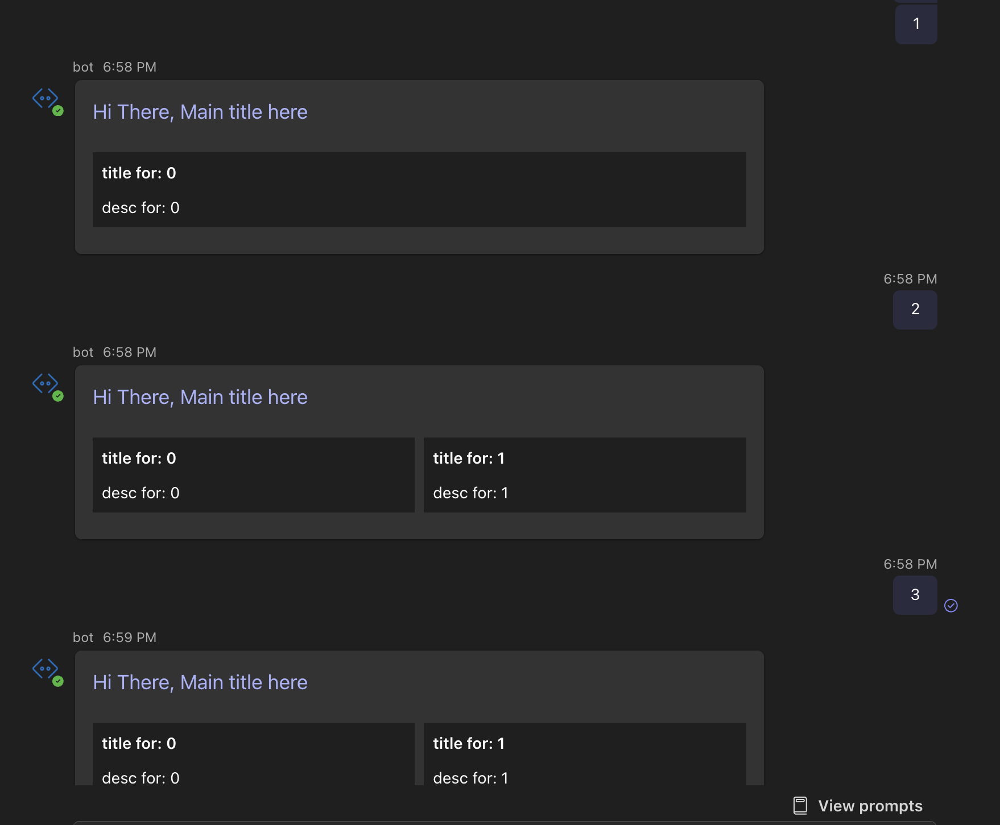

# Code Sample for Bot layout discrepancy between web and mobile if the bot number is odd

## Card template

The adaptive-card's template is in `./cards/welcome.json`.

- It has at most 4 cells
- Split into 2 columns
- Each cell will hide if its title is empty

## How to test different number of cells 

- Using VSCode to start the project.
- Type the count to bot, it will reply a Table with different number of cells.
- Then observe the difference in different platforms.

For example:

